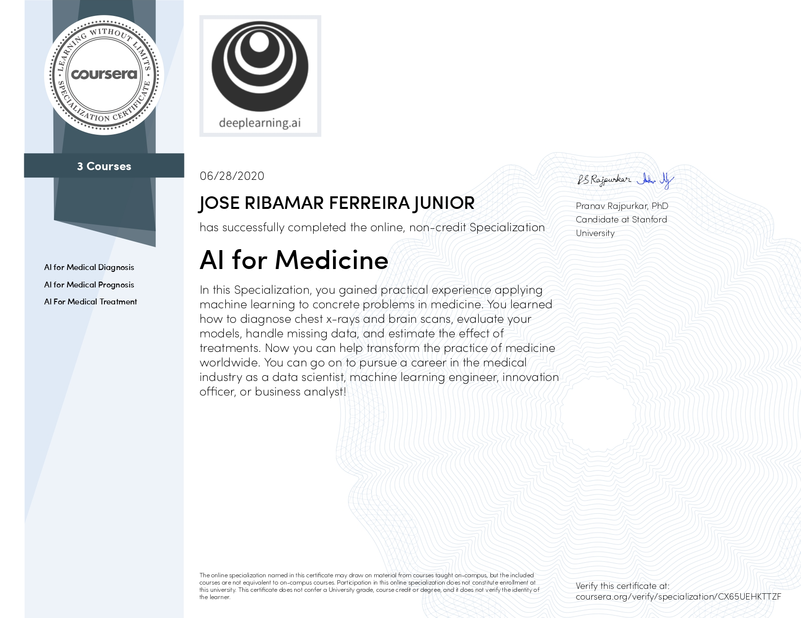
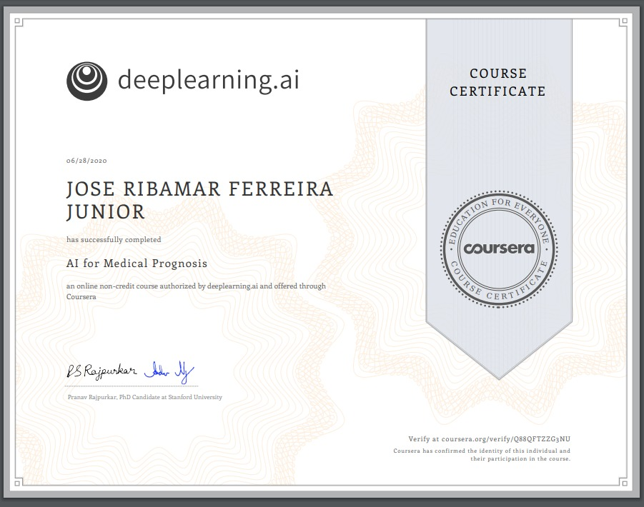
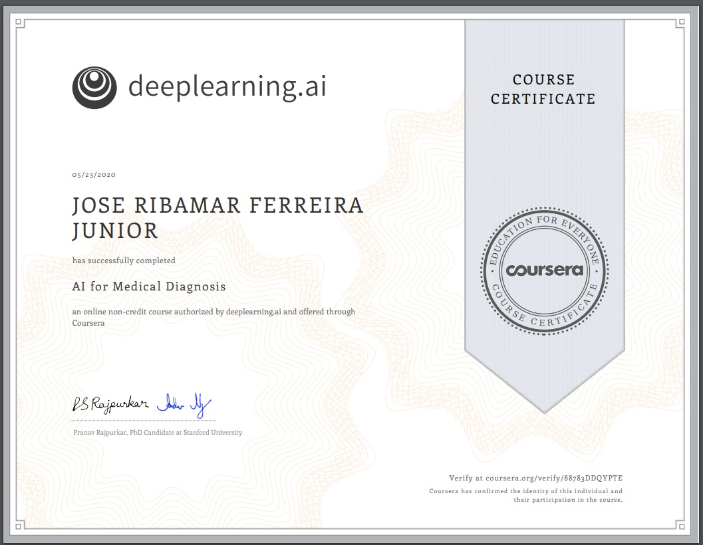
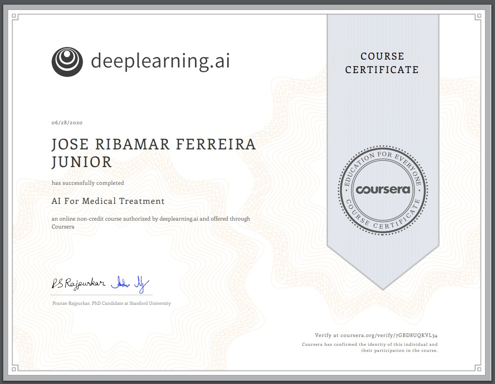

# AI for Medicine Specialization

Data Scientist Jose R F Junior - web2ajax@gmail.com

About this Specialization
65,149 recent views
AI is transforming the practice of medicine. It’s helping doctors diagnose patients more accurately, make predictions about patients’ future health, and recommend better treatments. This three-course Specialization will give you practical experience in applying machine learning to concrete problems in medicine.

These courses go beyond the foundations of deep learning to teach you the nuances in applying AI to medical use cases. If you are new to deep learning or want to get a deeper foundation of how neural networks work, we recommend taking the Deep Learning Specialization.

Applied Learning Project
Medicine is one of the fastest-growing and important application areas, with unique challenges like handling missing data. You’ll start by learning the nuances of working with 2D and 3D medical image data. You’ll then apply tree-based models to improve patient survival estimates. You’ll also use data from randomized trials to recommend treatments more suited to individual patients. Finally, you’ll explore how natural language extraction can more efficiently label medical datasets.

## Certificate

